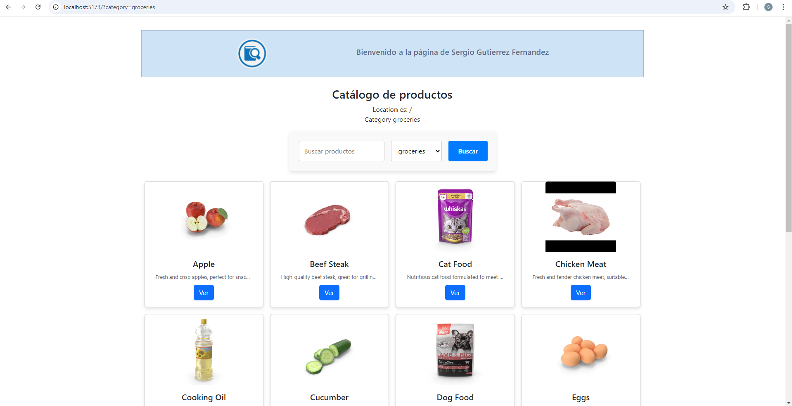
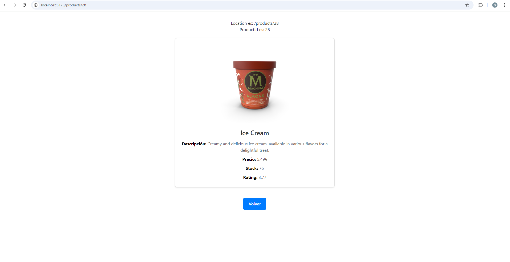

# 🛍️ IWEB_p2_productos

> **ES**: Proyecto desarrollado en la asignatura de **Ingeniería Web** en 4º curso de **GITST** (Grado en Ingeniería de Tecnologías y Servicios de Telecomunicación) en la **ETSIT**.  
> **EN**: Project developed for the **Web Engineering** course in the 4th year of **GITST** (Degree in Engineering of Telecommunication Technologies and Services) at **ETSIT**.

---

## 📌 Descripción | Description

🟢 **ES:**  
_IWEB_p2_productos_ es una aplicación web para la gestión y visualización de productos. Permite a los usuarios navegar por un catálogo de productos, filtrar por categorías y ver detalles individuales de cada artículo. Utiliza la API pública **DummyJSON** para obtener los datos.

🔵 **EN:**  
_IWEB_p2_productos_ is a web application for managing and viewing products. It allows users to browse a product catalog, filter by categories, and view detailed information about each item. The app uses the **DummyJSON** public API to fetch data.

---

## 📸 Capturas de pantalla | Screenshots

🟢 **ES:** Aquí tienes una vista previa de la aplicación en acción.  
🔵 **EN:** Here’s a preview of the application in action.  

### 📋 Vista del catálogo de productos | Product catalog view  
  
_🛒 Interfaz de listado de productos con opciones de filtrado._  
_🔍 Product listing interface with filtering options._

### 📄 Vista de detalles del producto | Product detail view  
  
_📌 Información detallada de un producto seleccionado._  
_📝 Detailed information about a selected product._

---

## 🚀 Características | Features

✅ **ES:**  
✔️ Exploración de un catálogo de productos con múltiples categorías.  
✔️ Filtros avanzados para facilitar la búsqueda de productos.  
✔️ Página de detalles con información específica de cada artículo.  
✔️ Diseño responsive y fácil de usar.  
✔️ Conexión con la API pública [DummyJSON](https://dummyjson.com/).  

✅ **EN:**  
✔️ Browse a product catalog with multiple categories.  
✔️ Advanced filters to refine product searches.  
✔️ Product detail page with specific information.  
✔️ Responsive and user-friendly design.  
✔️ Uses the public API [DummyJSON](https://dummyjson.com/).  

---

## 🛠️ Tecnologías | Technologies Used

- 🟡 **JavaScript (ES6+)** → Lenguaje principal del proyecto.  
- 📄 **HTML5** → Estructura de la aplicación.  
- ⚛ **[React](https://reactjs.org/)** → Biblioteca de UI de JavaScript.  
- ⚡ **[Vite](https://vitejs.dev/)** → Entorno de desarrollo rápido.  
- 🎨 **CSS** → Estilización responsiva y moderna.  
- 🌍 **[DummyJSON API](https://dummyjson.com/)** → API de productos de prueba.  

---

## 📦 Instalación | Installation

🟢 **ES:**  
Sigue estos pasos para instalar y ejecutar el proyecto:

```bash
git clone https://github.com/serguccierrez/IWEB_p2_productos.git
cd IWEB_p2_productos
npm install
npm run dev
```

Abre tu navegador en `http://localhost:3000`.

🔵 **EN:**  
Follow these steps to install and run the project:

```bash
git clone https://github.com/serguccierrez/IWEB_p2_productos.git
cd IWEB_p2_productos
npm install
npm run dev
```

Open your browser at `http://localhost:3000`.

---

## 📂 Estructura del Proyecto | Project Structure

```
IWEB_p2_productos/
├── public/         # Archivos estáticos | Static files
├── src/
│   ├── components/ # Componentes reutilizables | Reusable components
│   ├── assets/     # Recursos gráficos y estilos | Assets and styles
│   ├── App.jsx     # Componente principal | Main component
│   ├── main.jsx    # Punto de entrada | Entry point
│   ├── config.js   # Archivo de configuración | Configuration file
├── package.json    # Dependencias | Dependencies
├── README.md       # Documentación | Documentation
```

---

## 📬 Contacto | Contact

📩 **serguccierrez** → [GitHub Profile](https://github.com/serguccierrez)  
Si tienes preguntas o sugerencias, crea un **issue** en este repositorio.  

If you have any questions or suggestions, feel free to open an **issue** in this repository.  

---

💡 _Made with ❤️ by **Serguccierrez**._